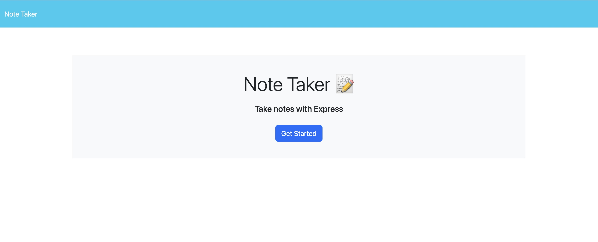
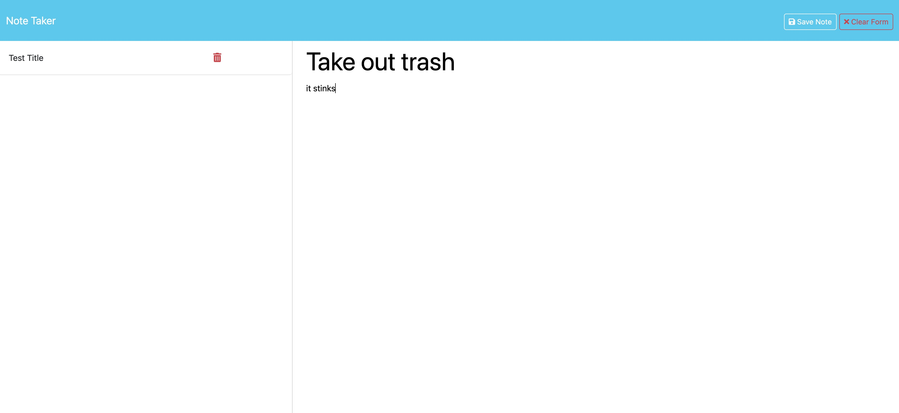
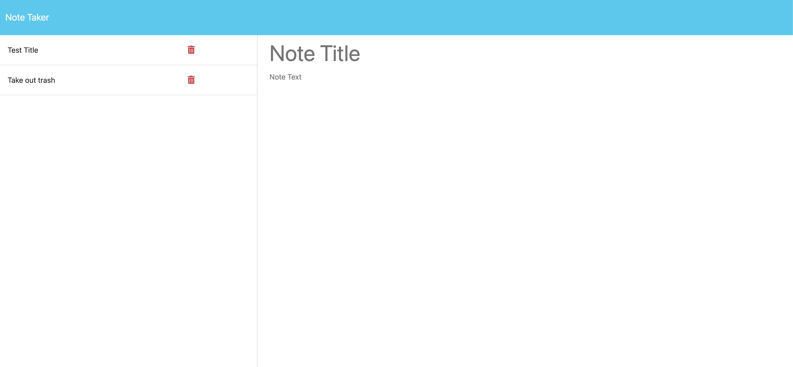

# Note Taker

## Description
Note Taker is a simple web application that allows users to write, save, and delete notes. The application uses an Express.js back end to handle note data storage and retrieval, saving notes in a JSON file.

## Technologies
Javascript, HTML, CSS, JSON, Render

## Repository
https://github.com/Jlvstrasse/note-taker

## Usage
On the landing page, click the "Get Started" button to navigate to the notes page.
Enter a note title and the note text in the provided fields.
Click the "Save Note" button (appears once you start typing a new note) to save the note.

Your saved notes will appear in the left-hand column. Clicking on a note in the list will display it in the main note area.
Click the trash icon next to the note you wish to delete.
The note will be removed from the list and deleted from the storage.

## License
MIT license

## Deployed Application
https://note-taker-lxuo.onrender.com

